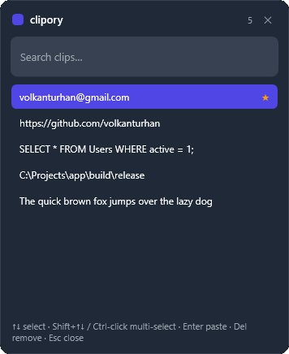
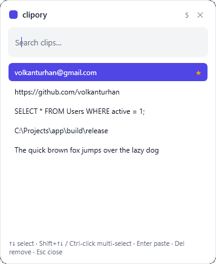

# clipory

**English | [Türkçe](README.tr.md)**

A lightweight Windows clipboard history manager.

clipory lives quietly in your system tray and remembers everything you copy.
Press a hotkey to bring up your recent clips, pick one, and it's pasted straight
into whatever app you're working in — no more losing something because you
copied one more thing.

<p align="center">
  
  
</p>

## Features

- **Clipboard history** — keeps your most recent copied text items.
- **Quick recall** — global hotkey (`Ctrl + Shift + V`) opens a searchable list.
- **Paste back instantly** — pick an item and it's pasted into the active app.
- **Tidy up fast** — select several clips (Ctrl-click or Shift) and delete them in one go.
- **Favourites** — pin the clips you reuse; they stay on top and are never dropped.
- **Survives restarts** — your history (and pins) are saved and restored.
- **Start with Windows** — optional, toggled from the tray menu.
- **Self-updating** — when a new version ships, clipory offers it from the tray; one click installs it.
- **English & Turkish** — switch the interface language from the tray.
- **Dark mode** — System / Dark / Light theme from the tray (follows Windows by default).
- **Stays out of the way** — runs from the system tray, no taskbar clutter.
- **Private by design** — everything stays on your machine; nothing is uploaded.

## Download

Grab the latest build from the [**Releases**](https://github.com/volkanturhan/clipory/releases/latest) page:

- **clipory-setup-…exe** — installer (recommended). No admin rights needed, and clipory keeps itself up to date from here on.
- **clipory-…exe** — portable single file; just run it, nothing to install.

Both are self-contained, so you don't need .NET installed. Windows 10/11, 64-bit.

## Run from source

Prefer to build it yourself? You'll need the [.NET 8 SDK](https://dotnet.microsoft.com/download/dotnet/8.0)
(the SDK, not just the runtime) on Windows.

```bash
git clone https://github.com/volkanturhan/clipory.git
cd clipory
dotnet run --project clipory/clipory.csproj
```

clipory starts quietly in the system tray — **no window pops up**. That's normal;
press the hotkey or click the tray icon to use it (see **How to use** below).

## How to use

1. Launch clipory — it starts quietly in the system tray.
2. Copy things as you normally would; clipory remembers them.
3. Press **`Ctrl + Shift + V`** to open the popup over whatever app you're in.
4. Start typing to filter, move with **↑ / ↓**, and press **Enter** (or
   double-click) to paste the chosen clip back into that app.
5. **Right-click** a clip (or **Ctrl + P**) to pin it. Select several with
   **Ctrl-click** or **Shift + ↑/↓**, then **Del** removes them all at once.
6. **Esc** or clicking away closes the popup.

Right-click the tray icon for **Open**, **Clear history**, **Start with
Windows**, and **Quit**.

## Where your data lives

History is stored locally at `%APPDATA%\clipory\history.json` and never leaves
your machine. Use **Clear history** in the tray menu to wipe it (pinned clips are
kept); pinned items can be removed individually from the popup.

## Build it yourself

Want to produce the release artifacts locally? They aren't checked into the repo:

```bash
# Portable self-contained exe + the Windows installer, into dist/release.
# (The installer step needs Inno Setup: winget install JRSoftware.InnoSetup)
pwsh tools/release.ps1
```

## Tech

- C# / WPF on .NET 8 (Windows)
- No third-party dependencies

## License

MIT — see [LICENSE](LICENSE).
