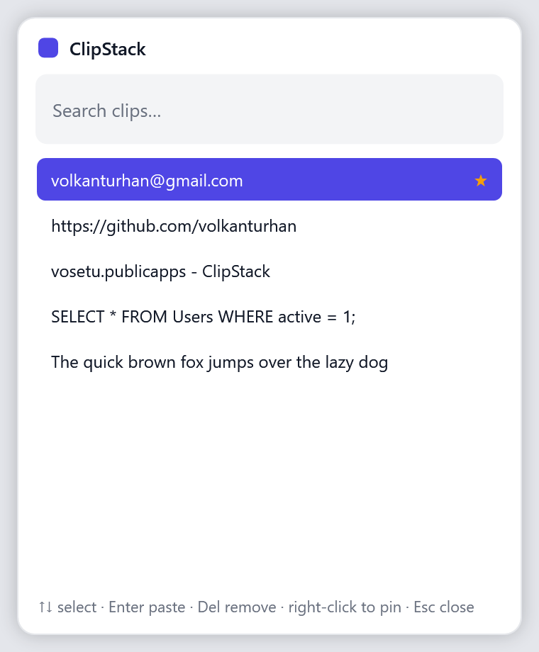

# ClipStack

**English | [Türkçe](README.tr.md)**

A lightweight Windows clipboard history manager.

ClipStack lives quietly in your system tray and remembers everything you copy.
Press a hotkey to bring up your recent clips, pick one, and it's pasted straight
into whatever app you're working in — no more losing something because you
copied one more thing.

<p align="center">
  
</p>

## Features

- **Clipboard history** — keeps your most recent copied text items.
- **Quick recall** — global hotkey (`Ctrl + Shift + V`) opens a searchable list.
- **Paste back instantly** — pick an item and it's pasted into the active app.
- **Favourites** — pin the clips you reuse; they stay on top and are never dropped.
- **Survives restarts** — your history (and pins) are saved and restored.
- **Start with Windows** — optional, toggled from the tray menu.
- **English & Turkish** — switch the interface language from the tray.
- **Stays out of the way** — runs from the system tray, no taskbar clutter.
- **Private by design** — everything stays on your machine; nothing is uploaded.

## Download

> **Note:** ClipStack isn't published yet — the link below goes live once the
> first release is created.

1. Download **`ClipStack.exe`** from the
   [latest release](https://github.com/volkanturhan/ClipStack/releases/latest).
2. Run it. No installation, no .NET required — it's a single self-contained file.
3. The first time, Windows SmartScreen may warn about an unknown publisher:
   click **More info → Run anyway**.

## How to use

1. Launch ClipStack — it starts quietly in the system tray.
2. Copy things as you normally would; ClipStack remembers them.
3. Press **`Ctrl + Shift + V`** to open the popup over whatever app you're in.
4. Start typing to filter, move with **↑ / ↓**, and press **Enter** (or
   double-click) to paste the chosen clip back into that app.
5. **Right-click** a clip (or **Ctrl + P**) to pin it; **Del** removes one.
6. **Esc** or clicking away closes the popup.

Right-click the tray icon for **Open**, **Clear history**, **Start with
Windows**, and **Quit**.

## Where your data lives

History is stored locally at `%APPDATA%\ClipStack\history.json` and never leaves
your machine. Use **Clear history** in the tray menu to wipe it (pinned clips are
kept); pinned items can be removed individually from the popup.

## Build from source

```bash
# Run it
dotnet run --project ClipStack/ClipStack.csproj

# Build the shareable single-file exe (output: dist/win-x64/ClipStack.exe)
pwsh tools/publish.ps1
```

## Tech

- C# / WPF on .NET 8 (Windows)
- No third-party dependencies

## License

MIT — see [LICENSE](LICENSE).
